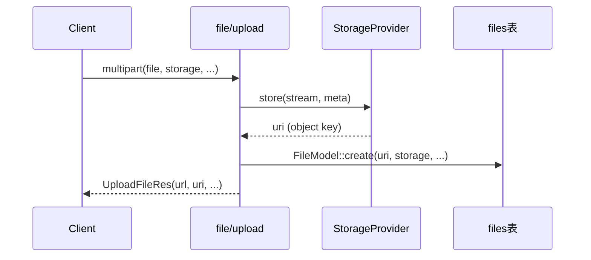

# 文件上传 OSS 与 Storage Provider 实现计划

> 状态：已实现  
> 相关代码：`src/controllers/v1/file.rs`、`crates/oic-core/src/services/file.rs`、`crates/oic-core/src/entities/file.rs`

## 背景与目标

当前文件上传仅完整实现了 **local 本地存储**，`store_file_oss` 为占位实现（只生成 uri，未实际上传到阿里云 OSS）。

本计划目标：

1. 完善 OSS 真实上传能力
2. 引入 **StorageProvider** 统一管理 local / oss（并为后续 qiniu 预留扩展）
3. 上传后写入 `files` 表（现有流程已具备，保持不变）
4. 删除时同步清理存储层对象；列表能力分层设计（DB 列表 + 存储层列表预留）

---

## 现状结论

| 能力 | 状态 |
|------|------|
| 本地上传 `store_file_local` | 已实现：写磁盘 + 返回 `YYYY/MM/{uuid}.ext` |
| OSS 上传 `store_file_oss` | **仅占位**：生成 uri，未实际上传 |
| 上传后写 `files` 表 | **已实现**：`upload` 末尾调用 `FileModel::create` |
| DB 列表/详情 | **已实现**：`/v1/file/list`、`/v1/file/one` |
| DB 删除 | **已实现**：`/v1/file/remove` 仅删 DB，**不删物理/OSS 文件** |

### 上传主流程（无需改表结构）



`files` 实体（`crates/oic-core/src/entities/file.rs`）字段已满足需求：

- `filename`：原始文件名
- `uri`：存储对象 key（如 `2025/06/uuid.jpg`）
- `storage`：存储类型（`local` / `oss`）
- `link`：图床地址（可选）
- `mime`、`size`、`status` 等

**不需要新增 migration。**

---

## 是否引入 Provider？

**建议：引入。**

在 `oic-core` 新增 `services/storage/` 模块，用 trait 统一本地与 OSS。

### 理由

1. 控制器 `src/controllers/v1/file.rs` 已有 `if local / else oss` 分支，后续还要加删除、列表，会继续膨胀
2. 配置注释已预留 `qiniu`，Provider 便于扩展第三后端
3. 删除需按 `file.storage` 路由到不同后端，适合 Provider 工厂
4. 与 loco 内置 `ctx.storage`（当前为 null driver）**无关**，那是框架队列/附件存储，保持独立

### 建议接口

```rust
#[async_trait]
pub trait StorageProvider: Send + Sync {
    /// 上传，返回对象 key（相对 uri，如 2025/06/uuid.jpg）
    async fn store(
        &self,
        reader: impl AsyncRead + Unpin + Send,
        params: &CreateFileReqParams,
    ) -> Result<String, StorageError>;

    /// 按 uri 删除存储对象
    async fn delete(&self, uri: &str) -> Result<(), StorageError>;

    /// 存储层列举（前缀可选，分页），供后续 OSS 管理接口使用
    async fn list(
        &self,
        prefix: Option<&str>,
        limit: u64,
        marker: Option<&str>,
    ) -> Result<StorageListResult, StorageError>;

    /// 拼接对外访问 URL
    fn public_url(&self, uri: &str) -> String;
}
```

### 实现类

| 实现 | 说明 |
|------|------|
| `LocalStorageProvider` | 复用现有 `store_file_local` 逻辑 |
| `OssStorageProvider` | 真实 OSS 上传/删除/列表 |

### 生命周期

`StorageProviderFactory::from_settings(&StorageSettings) -> Arc<dyn StorageProvider>`

在 `src/app.rs` 的 `after_context` 中构建并放入 `shared_store`（与 `Settings` 同级），避免每次请求重复建连。

---

## 配置扩展（StorageSettings）

在 `crates/oic-core/src/services/settings.rs` 扩展（保持与现有扁平风格一致）：

| 字段 | local 含义 | oss 含义 |
|------|-----------|----------|
| `driver` | `local` | `oss` |
| `path` | 本地根目录 | bucket 名称（沿用现有注释） |
| `uri` | 公网访问前缀 | CDN 或 bucket 公网域名前缀 |
| `endpoint` | — | `https://oss-cn-hangzhou.aliyuncs.com` |
| `access_key_id` | — | 建议 `{{ get_env(name="OSS_ACCESS_KEY_ID") }}` |
| `access_key_secret` | — | 建议 `{{ get_env(name="OSS_ACCESS_KEY_SECRET") }}` |
| `region` | — | 可选，如 `cn-hangzhou` |
| `prefix` | — | 可选对象前缀，如 `uploads` |

### development.yaml 示例（OSS）

```yaml
settings:
  storage:
    driver: oss
    uri: https://your-bucket.oss-cn-hangzhou.aliyuncs.com
    path: your-bucket
    endpoint: https://oss-cn-hangzhou.aliyuncs.com
    access_key_id: {{ get_env(name="OSS_ACCESS_KEY_ID", default="") }}
    access_key_secret: {{ get_env(name="OSS_ACCESS_KEY_SECRET", default="") }}
    region: cn-hangzhou
    prefix: uploads
```

### development.yaml 示例（本地，保持现状）

```yaml
settings:
  storage:
    driver: local
    uri: http://localhost/uploads
    path: /Users/aqrun/workspace/www/uploads
```

### 对象 key 规则

抽取公共函数 `build_object_key(filename) -> YYYY/MM/{uuid}.ext`（与现有一致）。

- 本地/OSS 相对路径：`2025/06/{uuid}.jpg`
- OSS 完整 key：`{prefix}/{date_path}/{uuid}.ext`（`prefix` 为空则不加前缀）

---

## OSS SDK 选型

**推荐：Apache OpenDAL**（`opendal` + feature `services-oss`，本地用 `services-fs`）

| 方案 | 优点 | 缺点 |
|------|------|------|
| **OpenDAL**（推荐） | 统一 write/delete/list API；local 与 oss 实现对称 | 新增依赖 |
| `ossify` | OSS 专用、功能完整 | 仅 OSS，多后端需各自实现 trait |
| `ali-oss-rs` | 社区 SDK | 同上 |

OSS 上传实现要点：

1. `Operator::write(key, body)` 或与 multipart stream 兼容的写入方式
2. 设置 `Content-Type` 为 `params.mime`
3. 保持「先存储、后入库」顺序；入库失败时可回滚删除已上传对象

依赖（`crates/oic-core/Cargo.toml`）：

```toml
opendal = { version = "0.47", features = ["services-oss", "services-fs"] }
```

---

## 代码改动范围

### 1. 新增 `crates/oic-core/src/services/storage/`

```
storage/
  mod.rs          # trait + factory + public_url 辅助
  local.rs        # LocalStorageProvider
  oss.rs          # OssStorageProvider (OpenDAL)
  error.rs        # StorageError
  key.rs          # build_object_key（可选）
```

### 2. 重构 `crates/oic-core/src/services/file.rs`

- 抽取 `build_object_key` 或迁入 `storage/key.rs`
- `store_file_local` / `store_file_oss` 可改为 thin wrapper 或标记 deprecated，供测试兼容

### 3. 简化 `src/controllers/v1/file.rs`

| 接口 | 改动 |
|------|------|
| `upload` | 从 `shared_store` 取 Provider，调用 `store()`，再 `FileModel::create` |
| `get_one` / `list` | 用 `provider.public_url(uri)` 拼接 URL |
| `remove` | 先查 DB → `provider.delete(uri)` → `FileModel::delete_one` |

**删除策略（建议）**：存储删除失败则整体失败，避免 DB 已删但 OSS 对象残留，或 DB 残留但对象已删的不一致。

### 4. 启动注入 `src/app.rs`

```rust
let provider = StorageProviderFactory::from_settings(&settings)?;
ctx.shared_store.insert::<Arc<dyn StorageProvider>>(provider);
```

---

## 列表与删除能力说明

### DB 列表（已有）

- 接口：`POST /v1/file/list`
- 基于 `files` 表分页查询
- OSS 切换后无需改接口；返回的 `url` 改为 Provider 拼接

### OSS 存储层列表（本阶段预留）

- Provider 实现 `list()` 方法
- **暂不暴露新 HTTP 接口**
- 后续如需 Bucket 对象浏览，可增加 `POST /v1/file/storage-list`

### 删除（本阶段增强）

- 在 `remove` 中接入 `provider.delete`
- 实现「删库 + 删对象」闭环

---

## 现有问题一并修复

1. **控制器分支不一致**：`storage == "local"` 与 `driver == "oss"` 判断不对称，应统一由 `settings.storage.driver` 驱动 Provider 选择
2. **fixture 拼写**：`src/fixtures/files.yaml` 中 `storage: 'oos'` 应为 `oss`（若仍使用）
3. **上传校验**：multipart 中的 `storage` 字段必须与 `settings.storage.driver` 一致（前端 `FileUploader` 已传 `storage` 参数）

---

## 测试建议

1. **单元测试**：`build_object_key` 格式；`public_url` 拼接
2. **集成测试（可选）**：local Provider 上传 + 删除临时目录文件
3. **手动验证 OSS**：
   - 配置真实 bucket
   - 上传图片，检查 OSS 控制台对象与 `files` 表记录
   - 验证返回 `url` 可访问
   - 调用 `remove` 确认对象与记录均删除

---

## 实施顺序

| 步骤 | 内容 |
|------|------|
| 1 | 扩展 `StorageSettings` + yaml 示例 |
| 2 | 引入 OpenDAL，实现 `LocalStorageProvider` / `OssStorageProvider` |
| 3 | 启动时注册 Provider 到 `shared_store` |
| 4 | 重构 `upload` / `get_one` / `list` / `remove` |
| 5 | 清理旧 `store_file_oss` 占位实现，补充代码注释 |

---

## 待确认项

以下决策已确认并落地：

1. **配置结构**：在 `StorageSettings` 上扁平扩展 OSS 字段
2. **SDK 选型**：Apache OpenDAL（`services-oss` + `services-fs`）
3. **删除策略**：存储删除失败则整体失败
4. **存储层列表**：Provider 预留 `list()`，本阶段不新增 HTTP 接口
5. **密钥管理**：`access_key_id` / `access_key_secret` 通过环境变量注入
